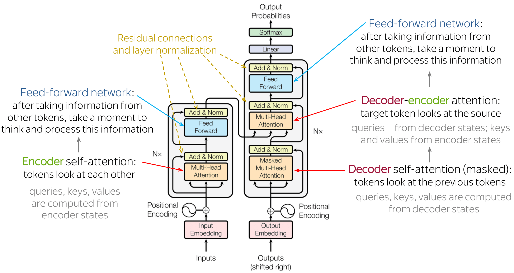

# My 10 projects with transformer architecture for NLP tasks

### Implemented projects
1) <b>[Implementation transformer model](https://github.com/Arseny5/nlp-personal-projects/tree/main/01-implement-vanilla-transformer):</b>
   - Implementation vanilla transformer from encoder-decoder classes to positional encoding, self-attention, multi-head attention, feed-forward network, residual connections and layer normalization.
   - Using [WMT 2014](https://huggingface.co/datasets/wmt14) English-German and English-French datasets solve text translation problem.
   - Analyze Label Smoothing in transformer classification with KLDiv loss.
   - Using [Tatoeba Russian-English](https://huggingface.co/datasets/tatoeba) dataset solve text translation problem.
3) [BERT analyzing](https://github.com/Arseny5/nlp-personal-projects/tree/main/03-bert-for-NER)
4) <b>[NER-problem with BERT](https://github.com/Arseny5/nlp-personal-projects/tree/main/03-bert-for-NER):</b>
   - Using [rubert-tiny2](https://huggingface.co/cointegrated/rubert-tiny2) work with Named Entity Recognition on [Russian Drug Reaction Corpus](https://github.com/cimm-kzn/RuDReC).
   - Use [Seqeval](https://github.com/chakki-works/seqeval) framework to compute metrics.
   - Freeze layers in rubert-tiny2 and fine-tuning model.
5) [GPT2 generation with different strategies](https://github.com/Arseny5/nlp-personal-projects/tree/main/03-bert-for-NER)
